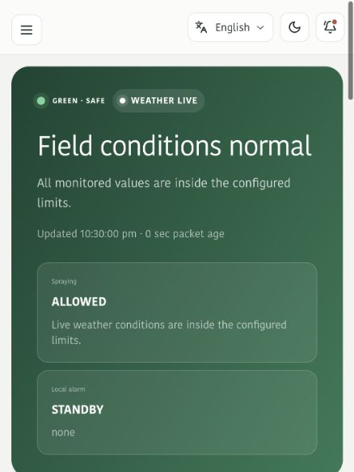

# KhetOS

**Field intelligence for safer farming.** KhetOS is an offline-first agricultural decision dashboard that turns field-level sensor readings into understandable alerts, spray-safety guidance, crop risk signals, and practical next steps.

[Live demo](https://ayush14mishra.github.io/KhetOS/) · [90-second judge walkthrough](docs/JUDGE_DEMO.md) · [System architecture](docs/IHAT1_ARCHITECTURE.md)



## The problem

Regional weather can miss the conditions inside an individual field. A farmer may need to decide whether to spray, irrigate, or inspect a crop while connectivity is poor and raw sensor numbers are difficult to interpret.

KhetOS follows a simple loop:

```text
Sense → Explain → Warn → Act → Preserve evidence
```

It combines localized field telemetry with clear, multilingual decision support. It does not present model output as a final diagnosis; risky actions require field verification or expert guidance.

## What makes it useful

- **Spray safety:** combines wind, rain, humidity, temperature, sensor freshness, and crop context into an explainable allow/caution/lock decision.
- **Localized early warnings:** highlights high wind, heat stress, heavy rain, abnormal soil moisture, and pest signals.
- **Offline-first operation:** cached readings, local profiles, service worker support, and device-side evidence keep the core experience usable with unreliable connectivity.
- **Farmer-friendly interface:** English and Hindi support, plain-language explanations, mobile layouts, theme control, and touch-friendly actions.
- **Crop and field context:** crop, growth stage, irrigation, soil, drainage, sensitive nearby areas, and farm zones shape the experience.
- **Evidence over black boxes:** confidence, checks, packet age, source labels, telemetry provenance, and action history remain visible.
- **Operational views:** farm map, weather jury, pest guard, scheme matching, market prices, devices, finance, safety, and proof logs.

## Frontend quality

- Responsive layouts across phone, tablet, and desktop breakpoints
- Semantic buttons, form labels, accessible names, and keyboard-operable controls
- Loading, recovery, offline, cached-data, stale-packet, empty, and warning states
- Light and dark themes with persisted preference
- Reduced reliance on color alone: state labels and explanations accompany status colors
- Realistic demo scenarios for normal, heat, rain, and wind conditions

## Technology

| Layer | Tools |
|---|---|
| Interface | React 19, TypeScript, Vinext/Next-compatible app structure |
| Styling | Tailwind CSS 4 plus a custom responsive design system |
| Icons | Lucide React |
| Local resilience | Service worker, browser storage, cached fallbacks |
| Edge deployment | Vite, Cloudflare Worker-compatible output |
| Optional integration | Python telemetry service, ESP32/BLE sensor gateway |

## Architecture

```text
ESP32 + field sensors
        ↓ BLE / Wi-Fi / LoRa
Gateway and local evidence log
        ↓ HTTP when available
Decision and alert services
        ↓ live or cached response
Responsive KhetOS dashboard
```

The checked-in frontend includes deterministic fallback scenarios, so reviewers can explore the product without hardware or a backend. Hardware and service integrations are optional extensions, not a requirement for viewing the interface.

## Quick start

Requires Node.js 22.13 or newer.

```bash
npm install
npm run dev
```

Open the local address printed in the terminal. To verify the production artifact:

```bash
npm run build
npm test
npm run lint
```

## Demo route for judges

1. Open the dashboard and switch between normal, heat, rain, and wind demo scenarios.
2. Inspect the explanation behind the spray decision rather than only the final status.
3. Open Pest Guard and compare the field alarm, evidence, and recommended verification steps.
4. Change the farmer profile, crop, or language to see how context changes the experience.
5. Turn off connectivity and confirm that cached field information and local actions remain available.

The full narrative is in [docs/JUDGE_DEMO.md](docs/JUDGE_DEMO.md).

## Repository map

```text
app/        Product interface, components, domain logic, and local fallbacks
backend/    Optional telemetry and decision services
iot/        Sensor contracts and wiring notes
docs/       Architecture, hardware setup, and judge walkthrough
tests/      Rendered-output and integration checks
worker/     Edge runtime entry point
```

## Responsible use

KhetOS is a prototype decision-support system, not a replacement for product labels, agronomists, government advisories, or emergency services. Sensor calibration and field verification are required before real agricultural use.

## Author

Designed and developed by [Ayush Mishra](https://github.com/Ayush14Mishra) for an AgriTech problem exploration. AI-assisted development tools were used during implementation; the repository keeps system decisions and limitations visible for review.
