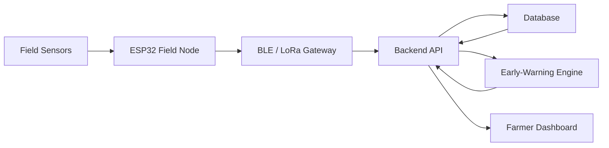

# 🌱 Intelligent Crop Microclimate Monitoring & Early-Warning System

> **Problem ID:** IHAT1  
> **Track:** AgriTech & Food Security  
> **Event:** IKIGAI 2026

## 🌾 Overview

The **Intelligent Crop Microclimate Monitoring & Early-Warning System** is a Cyber-Physical System designed to monitor real-time environmental and soil conditions directly at the field level.

Unlike general weather forecasts, the system collects **localized field data** such as temperature, humidity, rainfall, wind speed, wind direction, light intensity, and soil conditions.

The collected data is processed to generate early warnings for conditions that may negatively affect crops or farming activities.

### 🚨 Early Warnings

- 🌧️ Heavy rainfall
- 🔥 Heat stress
- 💨 High wind speed
- 🧪 Unsafe crop-spraying conditions
- 🌱 Abnormal soil/environmental conditions

---

# 🎯 Problem Statement

Farmers often depend on regional weather forecasts that may not accurately represent conditions inside their individual fields.

### 1. Lack of Field-Level Microclimate Data
General weather forecasts cannot accurately represent temperature, humidity, rainfall, wind, light, and soil conditions for every individual field.

### 2. Sudden Weather & Crop Damage
Heavy rainfall, extreme temperatures, and strong winds can damage crops before farmers have enough time to respond.

### 3. Unsafe Crop-Spraying Conditions
High wind speed, rainfall, and unsuitable environmental conditions can cause pesticide drift, chemical wastage, and ineffective spraying.

### 4. Limited Real-Time Monitoring & Alerts
Farmers lack continuous monitoring systems capable of providing immediate warnings when environmental conditions become dangerous.

### 5. Rural Connectivity Challenges
Cloud-only agricultural systems may become unreliable in areas with weak or unavailable internet connectivity.

---

# 💡 Our Solution

We propose a distributed **IoT-based microclimate monitoring network** installed directly inside agricultural fields.

Sensors continuously collect environmental and soil data.

The ESP32-based field node processes and transmits these readings while a gateway/backend stores and analyzes the data.

When dangerous conditions are detected, the system generates localized alerts and displays them on the farmer dashboard.

The system is designed around:

**Sense → Connect → Analyze → Alert → Act**

---

# ⚙️ System Workflow

```text
FIELD
 │
 ├── Temperature & Humidity Sensor
 ├── Rain Gauge
 ├── Anemometer
 ├── Wind Direction Sensor
 ├── Light Sensor
 └── Soil Sensor
        │
        ▼
    ESP32 Field Node
        │
        │ BLE / LoRa / Wi-Fi
        ▼
      Gateway
        │
        ▼
 Backend / Processing Engine
        │
        ├── Threshold Analysis
        ├── Microclimate Analysis
        ├── Alert Detection
        └── Data Storage
        │
        ▼
 Farmer Web Dashboard
        │
        ├── Live Conditions
        ├── Historical Data
        ├── Device Status
        └── Early Warnings
```

---

# 📡 Parameters Monitored

| Parameter | Purpose |
|---|---|
| 🌡️ Temperature | Detect heat stress and temperature variation |
| 💧 Humidity | Monitor atmospheric moisture and spraying conditions |
| 🌧️ Rainfall | Detect rainfall intensity and accumulation |
| 💨 Wind Speed | Detect dangerous winds and spraying risk |
| 🧭 Wind Direction | Understand wind movement and spray drift |
| ☀️ Light Intensity | Monitor sunlight availability |
| 🌱 Soil Conditions | Monitor field and root-zone conditions |

---

# 🚨 Early-Warning Engine

Sensor readings are continuously evaluated against configurable agricultural thresholds.

### Heavy Rainfall Alert

Triggered when rainfall exceeds the configured safe threshold.

### Heat Stress Alert

Triggered when field temperature reaches potentially harmful levels for the selected crop.

### High Wind Alert

Warns farmers when wind speed becomes dangerous for crops or agricultural operations.

### Unsafe Spraying Alert

The system combines parameters such as:

```text
Wind Speed
     +
Rainfall
     +
Humidity
     +
Temperature
     ↓
Spraying Condition Analysis
     ↓
SAFE / CAUTION / UNSAFE
```

Instead of looking at a single parameter, multiple environmental conditions can therefore be considered before recommending spraying.

---

# 🧠 Key Features

### 📊 Real-Time Microclimate Dashboard

Displays live:

- Temperature
- Humidity
- Rainfall
- Wind speed
- Wind direction
- Light intensity
- Soil conditions

### 🚨 Localized Early Warnings

Alerts are generated using measurements from the farmer's actual field instead of relying entirely on regional forecasts.

### 📶 Offline-Friendly Communication

Field nodes can collect data locally and communicate through short/long-range technologies such as BLE or LoRa.

### 💾 Local Data Logging

Sensor readings can be temporarily stored when connectivity is unavailable and synchronized later.

### 📈 Historical Analysis

Stored sensor readings allow farmers to understand environmental patterns over time.

### 🌾 Crop-Specific Thresholds

Different crops tolerate different environmental conditions. Alert thresholds can therefore be configured according to the selected crop.

---

# 🔌 Hardware Architecture

## Main Controller

### ESP32 Development Board

Responsible for:

- Reading sensor values
- Basic edge processing
- Local communication
- Sending readings to the gateway/backend
- Managing offline sensor data

## Sensors & Modules

| Component | Function |
|---|---|
| ESP32 | Main IoT controller |
| SHT31 / Environmental Sensor | Temperature & humidity |
| Rain Gauge | Rainfall measurement |
| Anemometer | Wind-speed measurement |
| Wind Vane | Wind-direction measurement |
| BH1750 | Light-intensity measurement |
| Soil Sensor | Soil-condition monitoring |
| MicroSD Module | Offline/local data logging |
| BLE | Nearby wireless communication |
| LoRa | Long-range field communication |
| Gateway | Connects field nodes to backend |

The final sensor selection can be changed depending on prototype availability and deployment requirements.

---

# 🌐 Communication Architecture

```text
Sensor
   ↓
ESP32
   ↓
BLE / LoRa / Wi-Fi
   ↓
Gateway
   ↓
Backend API
   ↓
Database
   ↓
Dashboard
```

### Why Gateway-Based Communication?

Agricultural fields may not always have reliable Wi-Fi or mobile connectivity.

Multiple field nodes can therefore communicate with a nearby gateway, which acts as the bridge between the field sensor network and the application.

---

# 🗄️ Data Architecture

A typical sensor reading follows a structure similar to:

```json
{
  "device_id": "FIELD_NODE_01",
  "timestamp": "2026-08-23T10:30:00",
  "temperature": 34.2,
  "humidity": 72,
  "rainfall": 3.4,
  "wind_speed": 12.5,
  "wind_direction": "SW",
  "light_intensity": 18500,
  "soil_moisture": 46
}
```

The backend uses these readings for:

- Dashboard visualization
- Historical analysis
- Alert generation
- Device monitoring
- Crop-specific decision support

---

# 🏗️ Software Architecture



---

# 💻 Technology Stack

## Frontend

- React / Next.js
- JavaScript / TypeScript
- Responsive Web UI
- Interactive sensor dashboard

## Backend

- Python
- FastAPI
- REST APIs
- Alert/decision engine

## IoT

- ESP32
- BLE
- LoRa / Wi-Fi
- Sensor interfaces

## Database

- MongoDB — application and device data
- InfluxDB — time-series sensor data where applicable

## Visualization

- Web Dashboard
- Grafana where applicable

## Deployment

- Docker
- Local/Edge Gateway
- Optional cloud synchronization

---

# 🔄 Offline-First Design

Internet connectivity in agricultural areas cannot always be guaranteed.

The system is therefore designed so that temporary internet failure does not immediately stop field monitoring.

```text
Internet Available
ESP32 → Gateway → Backend → Database → Dashboard

Internet Unavailable
ESP32 → Local Storage / Gateway Cache

Internet Restored
Stored Readings → Backend → Database → Dashboard
```

This allows environmental measurements to continue being collected even during temporary network interruptions.

---

# 🌟 Innovation

### Hyperlocal Monitoring

Measurements come directly from the agricultural field rather than only from distant weather stations.

### Cyber-Physical Integration

The project connects:

**Physical Environment → Sensors → Embedded System → Communication Network → Software Intelligence → Farmer**

### Multi-Sensor Decision Making

Multiple sensor measurements can be combined to determine whether agricultural operations such as spraying are safe.

### Low-Cost Distributed Nodes

Multiple affordable field nodes can potentially cover different sections of a farm instead of requiring one expensive professional weather station.

### Connectivity-Aware Architecture

BLE, LoRa, local storage, and gateway communication make the architecture more suitable for rural deployment.

---

# 📈 Scalability

The prototype can begin with:

```text
1 Farm
   ↓
1 Gateway
   ↓
Multiple Sensor Nodes
```

and later scale toward:

```text
Multiple Farms
      ↓
Village Gateway Network
      ↓
Regional Microclimate Network
```

Each additional field node can contribute localized environmental information.

---

# 🔮 Future Scope

Future versions can include:

- AI-based microclimate prediction
- Crop-specific stress prediction
- Disease-risk forecasting
- Automated irrigation integration
- Satellite-data integration
- Weather API fusion
- Mobile application
- SMS/voice alerts
- Regional-language support
- Solar-powered field nodes
- Advanced Soil Spectra integration
- Predictive spraying windows

---

# 🌍 Expected Impact

The system aims to help farmers:

- Detect dangerous environmental conditions earlier
- Reduce unnecessary pesticide spraying
- Reduce chemical drift
- Make better irrigation decisions
- Reduce weather-related crop damage
- Access field-level environmental intelligence
- Make decisions using measured data instead of assumptions

---

# 🧪 Prototype Testing

The prototype should be validated by checking the complete pipeline:

```text
Sensor Reading
      ↓
ESP32 Acquisition
      ↓
Communication
      ↓
Backend Reception
      ↓
Database Storage
      ↓
Threshold / Alert Processing
      ↓
Dashboard Update
      ↓
Farmer Warning
```

Testing should include both normal and extreme simulated sensor conditions to verify that alerts are generated correctly.

---

# 🛡️ Reliability Considerations

For real-world deployment, the system should consider:

- Sensor calibration
- Missing sensor readings
- Communication failure
- Gateway failure
- Duplicate readings
- Incorrect sensor values
- Offline storage
- Timestamp synchronization
- Device identification
- Weatherproof sensor enclosures

---

# 🏆 IKIGAI 2026

**Problem ID:** IHAT1

### Intelligent Crop Microclimate Monitoring and Early-Warning System

> Building a field-level environmental intelligence system that transforms real-time sensor measurements into actionable early warnings for farmers.

---

## 👥 Team

**Frontend & Hardware:** Riya Pradeep Kasat  
**Backend & IoT:** Ayush

---

## 📚 Research Areas

The project is based around research and engineering concepts including:

- Precision agriculture
- Agricultural IoT
- Wireless sensor networks
- Microclimate monitoring
- Edge computing
- Environmental sensing
- Early-warning systems
- Smart agriculture
- Cyber-Physical Systems

---

# 📄 License

This project was developed as an academic/hackathon prototype for **IKIGAI 2026**.

---

<p align="center">

### 🌱 Measure Locally. Detect Early. Farm Smarter.

**Intelligent Crop Microclimate Monitoring & Early-Warning System**

</p>
